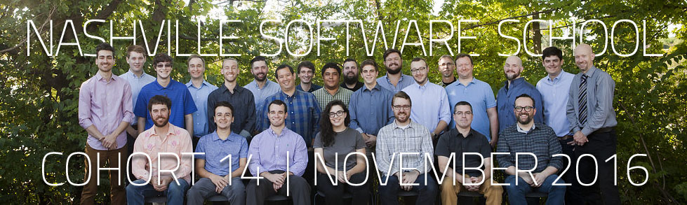

# Eric Denton Personal Website
## [iamericanartist.github.io](https://iamericanartist.github.io/)

### [NSS](http://nashvillesoftwareschool.com/) Cohort D14  
Instructors - [Joe Shephard](https://github.com/JoeShep)(Front-End) and [Scott Humphries](https://github.com/sscotth)(Back-End)  
Advisors - [Caitlin Stein](https://github.com/C-Stein), [Callan Morrison](https://github.com/morecallan), and [Christina Young](https://github.com/ChristinaJYoung)

***

 Social Media:
  <a rel="nofollow" href="https://github.com/iamericanartist" title="Github"> Github </a> | 
  <a rel="nofollow" href="https://www.linkedin.com/in/iamericanartist" title="LinkedIn"> LinkedIn </a>  | 
  <a rel="nofollow" href="http://codepen.io/IAmericanArtist/" title="CodePen"> CodePen </a> | 
  <a rel="nofollow" href="https://www.instagram.com/iamericanartist/" title="Instagram"> Instagram </a>

***

  

  <h3 align="center">Proud Member:</h3>
    
  

<!-- 
/////////////////////////////////  ATTRIBUTION  /////////////////////////////////
I decided to use a (heavily modified) theme I found on BootstrapZero.com. I did so knowing that it's a little strange for a developer to use template when they themselves should be able to do this on their own. I FULLY AGREE. I feel comfortable with every technology used in this theme and plan on creating my own site from the ground up when my life settles down a bit after completing my education at [Nashville Software School](nashvillesoftwareschool.com), my son settles into his daycare/preschool, AND I AM EMPLOYED!

Thank you for looking at the source code, by the way! I appreciate your time, and would love to talk shop, grab a beverage, or connect in whatever form suits you. I hope to hear from you soon!

Sincerely,

Eric Denton
ttyl@iamericanartist.com

Theme used:
  Landing Zero
    A free landing page theme from BootstrapZero 
    http://www.bootstrapzero.com
    LicenseGPL | VersionBootstrap 3.3.4
 -->
